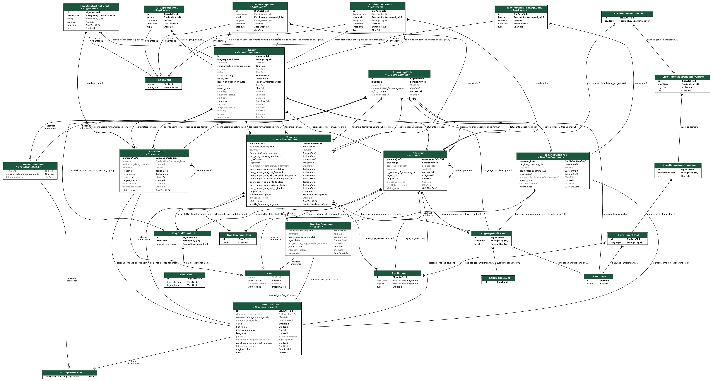

# Django ORM Models

Some of these models contain [enumerations](https://docs.djangoproject.com/en/4.1/ref/models/fields/#enumeration-types).
This was a conscious choice: in case where adding a type will inevitably result in change of code that works with these types, it made no sense to create another table just for the sake of it.
The additional queries to the database could outweigh the benefit of storing only integer indexes.
The strings stored in the database are kept as short as possible, though, and, wherever possible, integers are used.

## Entity Relationship Diagram

(Generated with [graph_models](https://django-extensions.readthedocs.io/en/latest/graph_models.html))

